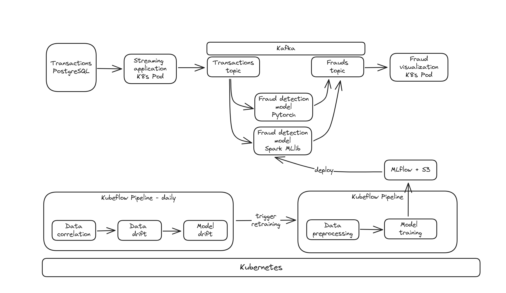

# Fraud Detection for Card transactions

Target Solution Architecture



TODOs:
- [ ] Create automation script to set up environment on any cloud or VM
  - [X] Kubernetes
  - [X] PostgreSQL
  - [X] Kafka
  - [ ] *Kubeflow+Mlflow
  - [ ] *Spark
- [ ] Ingest data from CSV to the PG
- [ ] Stream data from PG to the Kafka "Transactions" topic
- [ ] *Deploy Pytorch model for fraud detection
- [ ] Deploy Spark MLlib model for fraud detection 
- [ ] *Create data exploration notebook on the PG data
- [ ] Notebooks
  - [ ] *model training notebook using Pytorch
  - [ ] model training notebook with MLlib
- [ ] *Pipelines
  - [ ] *data drift detection pipeline
  - [ ] *model training using Pytorch
  - [ ] *model training using Spark
- [ ] Visualization of Fraud detection results

## Environment setup

### VM

Create a VM with at least 8cpu & 64GB of memory & 200GB of disk

### Toolchain

Install the toolchain using the script `01_setup.sh`, invoke line by line and check the outcomes

### Secrets


### Ingest the data and upload to the PostgreSQL

```bash
export PG_URIS=$(juju run data-integrator/leader get-credentials -m pg | yq '.postgresql.uris' | sed "s@postgresql-k8s-primary.pg.svc.cluster.local@$(kubectl get svc -n pg postgresql-k8s-primary -o json | jq -r '.spec.clusterIP')@")
echo PG_URIS=$PG_URIS
python3 ./apps/ingest.py
```

### 
